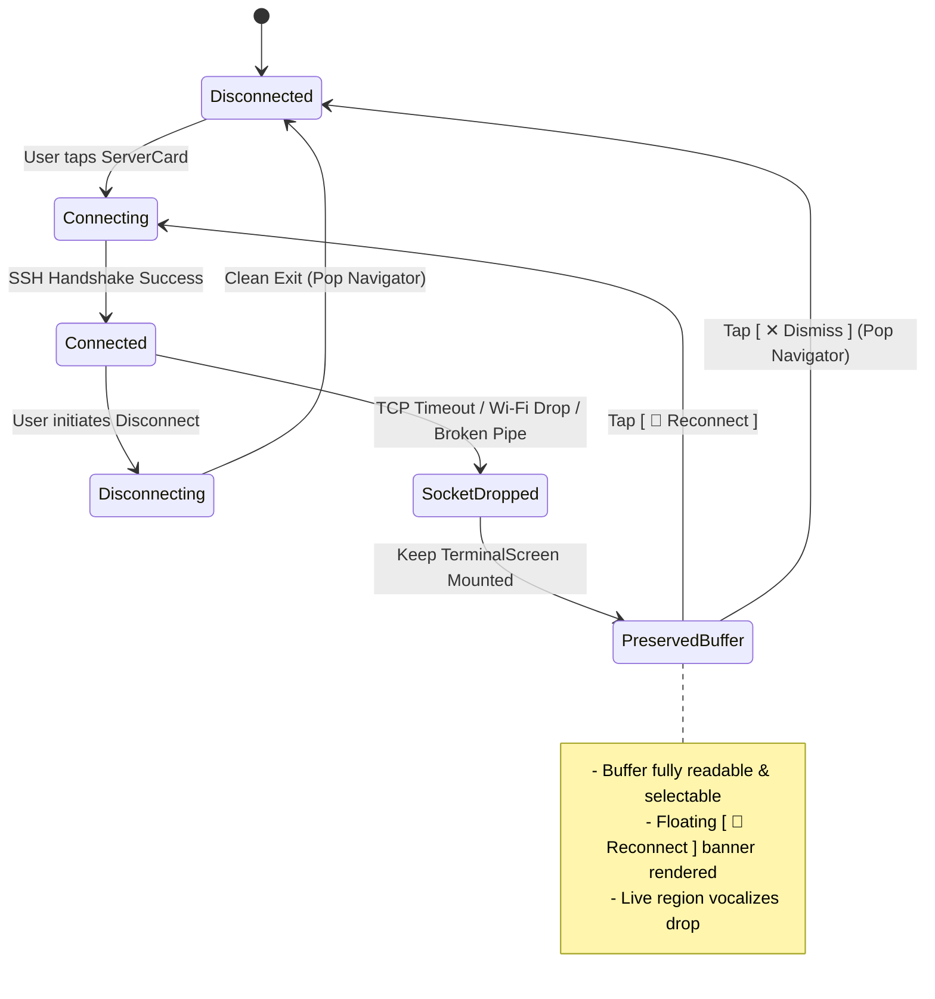
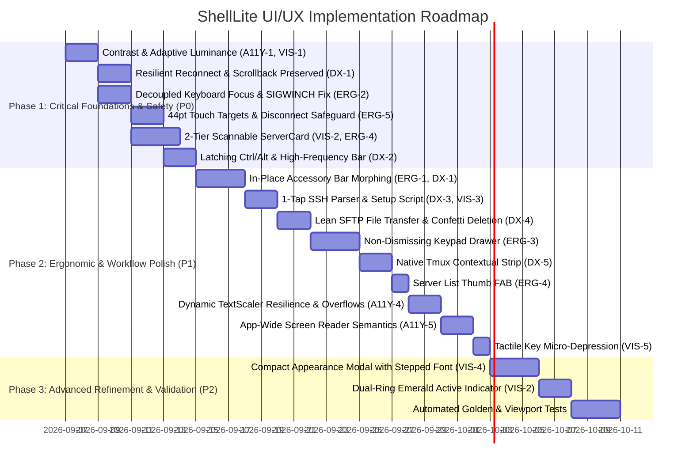

# ShellLite UI/UX Master Upgrade Proposal & Architectural Blueprint

**Document Version**: 1.0.0 (Production Deliverable)  
**Author**: ShellLite Multi-Specialist UI/UX Review Team  
- Agent 1: Lead UI/UX Architect (Lead & Synthesizer)  
- Agent 2: Mobile Ergonomics & Touch Interaction Specialist  
- Agent 3: Visual Design & Design Systems Specialist  
- Agent 4: Developer Experience & Terminal Workflow Specialist (DX)  
- Agent 5: Accessibility & Edge-Case Specialist (a11y)  
**Target Codebase**: `lib/screens/`, `lib/widgets/`, `lib/theme/`, `lib/providers/`, `lib/services/`  
**Compliance Standards**: WCAG 2.1 AA (Contrast, Touch Target $\ge 44\times 44\text{pt}$, Motion Reduction 2.3.3, Timing 2.2.1, Pointer Gestures 2.5.1), Steven Hoober Mobile Thumb-Zone Ergonomics, xterm.dart Terminal Canvas Sanctity, and ShellLite "Lite" North Star.  
**Date**: 2026-09-06  

---

## 1. Executive Summary & Core UX Vision

### 1.1 Deliberation Journey & Multi-Specialist Synthesis
Across four structured rounds of independent codebase auditing, cross-specialist debate, and architectural triage, five specialist perspectives converged to evaluate the ShellLite Flutter terminal client. Each domain uncovered critical operational defects in the existing implementation:

1. **Mobile Ergonomics & Touch Gestures (Agent 2)**:
   - **Tap Targets Under Standard**: Interactive elements across primary surfaces fall severely below Apple HIG ($44\times 44\text{pt}$) and Material 3 ($48\times 48\text{dp}$) minimums. Terminal AppBar icon buttons measure only $34\times 34\text{dp}$ (`constraints: BoxConstraints(minWidth: 34, minHeight: 34)` in `lib/screens/terminal_screen.dart:254, 262, 270, 278`), pinned accessory keys measure $34\times 34\text{dp}$ (`lib/widgets/keyboard_accessory_bar.dart:153, 194`), and the floating selection copy bar is constrained to an un-tappable $24\text{dp}$ height (`lib/screens/terminal_screen.dart:438-474`).
   - **Terminal Viewport Instability (`SIGWINCH`)**: In `lib/screens/terminal_screen.dart:122-131` and `lib/widgets/keyboard_accessory_bar.dart:72-75`, horizontal scrolling across the accessory bar or tapping navigation keys unconditionally executes `requestKeyboard()`. This forcibly summons the soft keyboard when the user intentionally closed it to inspect logs, instantly resizing the terminal canvas, causing frame drops, and firing unwanted `SIGWINCH` signals that corrupt terminal layouts in `vim`, `htop`, `tmux`, and `less`.
   - **Selection Handle Overlap & Thumb Occlusion**: In `lib/widgets/terminal_selection_handle.dart:32-50`, start and end handle hitboxes ($44\text{px}$ wide) overlap when words are narrower than $36\text{px}$. The end handle's gesture detector swallows the start handle's touch events. Furthermore, handle knobs are centered directly on the character baseline, causing the user's thumb to completely obscure the active text during dragging. Zero boundary auto-scroll exists.
   - **Accidental Disconnect Hazard**: The immediate-kill Disconnect button (`Icons.power_settings_new_rounded`, red) sits adjacent to Terminal Settings in the top AppBar with $0\text{px}$ margin and zero physical friction, turning a routine configuration tap into an immediate session termination.

2. **Visual Design & Design Systems (Agent 3)**:
   - **Surface Elevation Inversion Across 5 Themes**: In Catppuccin Mocha, Dracula, Nord, Tokyo Night, and Solarized Dark (`lib/theme/terminal_theme_presets.dart:146, 199, 252, 305, 358`), the `surface` token is defined with lower luminance than the `background` canvas (e.g. Catppuccin surface `#181825` vs background `#1E1E2E`). As a result, Material 3 AppBars, dialogs, bottom sheets, and cards appear darker than the background canvas, visually inverting physical elevation hierarchy.
   - **Fractional Metrics & Spacing Chaos**: Spacing is fragmented across arbitrary sub-pixel numbers (`vertical: 3.5`, `vertical: 6`, `fontSize: 12.5`, `padding: 14`, `42x42` icon boxes), causing anti-aliasing blur and layout jitter on standard-density displays.
   - **Absence of Centralized TextTheme**: `AppTheme.buildTheme()` lacks a standardized `TextTheme`. Typography styles are instantiated ad-hoc with uncalibrated contrast ratios. Muted color tokens (e.g. `textMuted: #6E7681` on card surface `#1F242C`) yield a failing contrast ratio of $3.39:1$.
   - **Cognitive Overload & "Chip Explosion"**: In `lib/widgets/server_card.dart:62-243`, packing server icons, display names, host strings, Key/Pass badges, tmux badges, and kebab menus into a single horizontal row triggers severe premature truncation on $320\text{px}$–$360\text{px}$ mobile viewports.

3. **DevOps & Terminal Workflow / DX (Agent 4)**:
   - **Catastrophic Disconnect Context Loss**: In `lib/screens/terminal_screen.dart:199-208`, when an SSH socket encounters an abrupt network drop (e.g. Wi-Fi to cellular transition or subway dead zone), the client immediately executes `Navigator.of(context).maybePop()`, while `lib/providers/session_store.dart:112-117` removes the session from memory. The terminal buffer is destroyed instantly, wiping out vital compiler errors, stack traces, and crash logs without allowing manual copy or reconnection.
   - **Missing `Ctrl` / `Alt` Modifiers & Incomplete Keymaps**: Mobile virtual keyboards lack physical modifier keys. ShellLite lacks sticky modifier latches on its accessory bar and omits `^O`, `^X`, `^G`, `^T`, and `^S` from its shortcuts, leaving developers trapped inside `nano`, `vim`, or `emacs` without the ability to save or exit. `Ctrl-C` (SIGINT) is buried 3 taps deep inside a modal bottom sheet.
   - **Tedious 4-Field Server Setup**: SREs and sysadmins connecting to cloud instances must copy-paste Display Name, Host, Port, and Username into separate fields. Pasting a standard OpenSSH command (`ssh -p 2222 user@host`) fails validation.
   - **SFTP Celebration Confetti Bloat**: In `lib/widgets/file_upload_modal.dart:45-110, 725-820`, remote file upload is burdened by 170+ lines of custom canvas confetti physics (`CelebrationBurstPainter`, `CelebrationParticle`) and an unnecessary blocking "Done" dismissal button, directly contradicting ShellLite's distraction-free ethos.
   - **Dormant Tmux Integration**: Despite highlighting `persistSession` (tmux), the terminal provides no quick-access controls for tmux prefixes or window switching on mobile touchscreens.

4. **Accessibility & Edge Cases / a11y (Agent 5)**:
   - **Catastrophic WCAG 2.1 AA Contrast Failures**: `lib/theme/app_theme.dart:97, 202` hardcodes `onPrimary: Colors.white` and `ElevatedButton(foregroundColor: Colors.white)`. Across 5 of the 6 dark themes, `primaryAccent` is a bright pastel or neon color (Catppuccin `#A6E3A1`, Dracula `#50FA7B`, Tokyo Night `#9ECE6A`, Nord `#A3BE8C`, Obsidian `#3FB950`). White text on these accents yields catastrophic contrast ratios between **$1.37:1$ and $2.54:1$** (far below the $4.5:1$ WCAG AA threshold). In contrast, dark foreground yields between **$8.27:1$ and $15.30:1$**.
   - **Solarized Dark Invisible Text Bug**: In `lib/theme/terminal_theme_presets.dart:337`, Solarized Dark sets `brightBlack: Color(0xFF002B36)`, which is identical to `background: Color(0xFF002B36)` (**$1.00:1$ contrast**). Code comments, CLI prompts, and git untracked files rendered in bright black are completely invisible.
   - **Dynamic Font Scaling (`textScaler`) Overflows**: In `lib/widgets/server_card.dart`, `lib/screens/server_form_screen.dart`, `lib/widgets/terminal_appearance_modal.dart:73`, and `lib/widgets/keyboard_accessory_bar.dart:314`, fixed-height containers (`SizedBox(height: 94)`) and rigid aspect ratios (`childAspectRatio: 2.1`) trigger severe `RenderFlex` yellow-and-black stripe overflows when system accessibility text scaling is enabled ($1.3\times$–$2.0\times$).
   - **Complete Absence of Screen Reader Semantics**: The codebase contains zero explicit `Semantics` widgets. Assistive technologies (TalkBack and VoiceOver) cannot determine active background sessions, cannot announce connection drops, and vocalize raw unformatted numbers for sliders.

---

### 1.2 ShellLite's "Lite" North Star
To resolve these audit findings without succumbing to feature bloat, all proposed architectural changes are strictly anchored in ShellLite's **"Lite" North Star**:

```
                              THE "LITE" NORTH STAR
                                        ▲
                                       / \
                                      /   \
                                     /     \
             DISTRACTION-FREE       /       \       FRICTIONLESS
             TERMINAL SANCTITY     /         \      VELOCITY
             (Zero occluding popups/           \     (1-tap connect, 1-tap parse,
              Zero SIGWINCH jitter)             \    1-tap reconnect preserving buffer)
             -----------------------             -----------------------------------
                                    \           /
                                     \         /
                                      \       /
               MOBILE ERGONOMICS       \     /      ZERO UNNECESSARY
               FIRST                    \   /       CONFIRMATION MODALS
               (Natural thumb zone,      \ /        (Tactile hold-to-disconnect,
                Rigid 44pt touch targets) ▼          Menu relocation, No modal dialogs)
```

1. **The Terminal Canvas is Sacred**: The terminal buffer, command output, and user keystrokes are the heart of the product. The UI chrome must never intrude upon, occlude, or resize the terminal buffer during interactive work. Floating callouts that jitter across the canvas and dual stacked toolbars that reduce shell height to a letterbox are strictly forbidden.
2. **Frictionless Velocity**: A sysadmin troubleshooting a production outage from a phone at 2 AM needs instant response. Connections must happen in 1 tap; process interrupts (`Ctrl-C`) must be 1 tap; server setup must parse from clipboard in 1 tap; and recovery from a subway Wi-Fi drop must take 1 tap without losing terminal scrollback.
3. **Zero Unnecessary Confirmation Modals**: We categorically reject the enterprise antipattern of blocking modal popups for routine actions (e.g. *"Are you sure you want to disconnect?"*). Safety must be engineered through tactile physical affordances (e.g. progressive 600ms hold-to-disconnect, safe session menu relocation) rather than disruptive dialogues.
4. **Mobile Ergonomics First**: Sysadmins operate phones with one hand while holding a laptop or subway handrail with the other. Primary actions (Add Server, Paste, Reconnect, Interrupt) must live in the natural thumb zone (lower 40% of the viewport) with guaranteed minimum $44\times 44\text{pt}$ touch targets.
5. **Aesthetic Precision**: Dark, low-eyestrain terminal palettes with monotonic elevation, strict 8-point spacing rhythm, crisp typography, and subtle micro-feedback.

---

## 2. Prioritized Action Matrix

The complete catalog of 20 audited enhancements and cross-specialist proposals has been arbitrated into **P0 (Must Have)**, **P1 (Should Have)**, **P2 (Future Exploration)**, and **Rejected (Anti-Lite)**:

| Priority | Feature / Tweak | Impact | Effort | Champion Specialist | Technical Rationale & Consensus |
|---|---|---|---|---|---|
| **P0** | **Resilient Network Reconnect & Preserved Scrollback Buffer** | Critical | Low (~40 lines) | DevOps / a11y | **Adopt Unanimously**: Eliminate auto-pop on socket drop (`terminal_screen.dart:199-208`, `session_store.dart:112-117`). Keep terminal mounted; preserve scrollback buffer. Render floating glassmorphic in-terminal reconnect banner (`[ 🔄 Reconnect ]` $\ge 44\text{pt}$, `liveRegion: true`) inside a floating `Stack` overlay (never flex `Column`), guaranteeing zero canvas resize and zero `SIGWINCH`. Auto-reattach tmux if enabled. |
| **P0** | **WCAG 2.1 AA Contrast Compliance & Adaptive Foreground Luminance** | Critical | Low (~30 lines) | a11y / Visual | **Adopt Unanimously**: Implement dynamic `computeOnPrimary(primaryAccent)` via direct WCAG relative luminance comparison (`lum > 0.1833 ? const Color(0xFF0B0F14) : Colors.white`). Eliminates the flaw in Flutter's `estimateBrightnessForColor` (which incorrectly yields 3.20:1 white text on Solarized Dark `#859900`), achieving 6.00:1 contrast (PASS AA). Fix Solarized Dark ANSI `brightBlack` from `#002B36` to `#657B83` (eliminates 1.00:1 invisible text). Calibrate Dracula/Tokyo Night `textSecondary` to $\ge 4.5:1$. Fix monotonic dark theme elevation. |
| **P0** | **Decoupled Keyboard Focus & Terminal Viewport Stability (`SIGWINCH` Fix)** | Critical | Low (~25 lines) | Ergonomics / DevOps | **Adopt Unanimously**: Decouple key taps from `requestKeyboard()`; delete pointer listener in accessory bar `ListView`. Stops unwanted soft keyboard popups when scrolling keys or navigating logs; eliminates `SIGWINCH` screen corruptions in vim/htop/tmux. |
| **P0** | **Strict 44×44pt Touch Target Standard & Terminal Header Safety** | High | Low (~35 lines) | Ergonomics / a11y | **Adopt with Refinements**: Enforce `minWidth: 44, minHeight: 44` across all interactive elements. Remove exposed 34px Disconnect button from primary AppBar; relocate Disconnect to Session Menu (`[⋮]`) or guard with a true 600ms hold using `onTapDown`/`onTapUp`/`onTapCancel` timer (avoiding 500ms `kLongPressTimeout` delay). Move Paste to accessory bar. Disable `centerTitle` on screens <380px. |
| **P0** | **2-Tier Resilient ServerCard Architecture** | High | Medium (~60 lines) | Visual / Ergonomics | **Adopt Unanimously**: Re-architect `ServerCard` into 2 vertical tiers: Tier 1 (Icon + Title & Monospace Host + 48×48 Kebab Menu); Tier 2 (Hairline divider + Auth/Tmux Badges + Inline Telemetry Strip). Frees +45% horizontal space, completely eliminating title truncation on 320px–360px phones. |
| **P0** | **Latching Modifier Keys (`Ctrl`/`Alt`) & High-Frequency Key Bar** | Critical | Low (~50 lines) | DevOps / Ergonomics | **Adopt with Refinements**: Implement sticky modifier latching engine (`Ctrl`, `Alt`) with 3 visual states (Inactive, Latched, Locked) and haptics, unlocking mobile `nano`/`vim`/`tmux` workflows. Default emergency keys: `Esc`, `Ctrl`, `Tab`, `Ctrl-C` (1-tap SIGINT abort with error tint), and arrows. Add missing control codes (`^O`, `^X`, `^G`, `^T`, `^S`) to extended keys. |
| **P1** | **In-Place Accessory Bar Morphing & Precision Selection Handles** | High | Medium (~90 lines) | Ergonomics / DevOps | **Adopt Morphing Rationale**: Morph `KeyboardAccessoryBar` in-place into Selection Bar (`[📋 Copy]`, `[🔤 Word]`, `[✕ Clear]`, with pinned emergency `[Esc]` and `[^C]` keys on the far right to prevent terminal lockout in vim/nano/tmux). Dynamic height `(52.0 * textScale.clamp(1.0, 1.35))`, responsive label (`textScale > 1.2 ? 'Copy' : 'Copy Selection'`), and horizontal scrolling to eliminate 29px–81px overflows on 320px screens. Dynamic stem inversion (-22dp upward stem) on bottom 32dp of canvas to prevent handle hitbox from overlapping or swallowing accessory bar taps. |
| **P1** | **1-Tap Smart SSH URI / Command Parser & Setup Script** | High | Low (~45 lines) | DevOps / Visual | **Adopt with User-Initiated Chip**: Add `[ 📋 Paste & Parse SSH Command ]` button at top of `ServerFormScreen` to auto-parse OpenSSH commands (`ssh -p 2222 user@host`) into 4 fields in 1 tap (no silent background scraping). Fixed 88/96px Port width. Inline `AnimatedCopyButton` and 1-line server setup script (`mkdir -p ~/.ssh...`). |
| **P1** | **Lean SFTP File Transfer & Confetti Deletion** | High | Net Negative (~150 lines) | DevOps / a11y | **Adopt Unanimously**: Delete `CelebrationBurstPainter` and `CelebrationParticle` (~170 lines removed). Implement 4dp linear progress bar with transfer rate, morphing to calm checkmark. 45% height modal with quick path chips (`[ Current ]`, `[ ~ ]`, `[ /tmp ]`, `[ /var/www ]`). Auto-dismiss in 1500ms (pauses when screen reader active). |
| **P1** | **Non-Dismissing Expandable Keypad Drawer** | High | Medium (~80 lines) | Ergonomics / DevOps | **Adopt with TextScaler Sizing**: Replace 55% modal bottom sheet with an inline accordion drawer (height 168–220dp based on `textScaler`). Non-dismissing keys allow multi-key navigation (`PgDn` × 5, `F1`–`F12`) without modal bouncing. 44×44pt collapse chevron. |
| **P1** | **Native Tmux Contextual Action Strip** | Medium-High | Low (~40 lines) | DevOps / Ergonomics | **Adopt with Contextual Drawer**: Contextual `[ ⊞ tmux ]` pill on accessory bar toggles a sleek 38dp non-dismissing secondary strip (`[+Win]`, `[→Next]`, `[←Prev]`, `[📜Scroll]`, `[⏏Detach]`) with explicit `Semantics(label:)`. Only visible when `profile.persistSession == true`. |
| **P1** | **Server List Thumb-Zone Floating Action Button (FAB)** | Medium | Low (~20 lines) | Ergonomics / Visual | **Adopt Compact FAB**: Bottom-right standard FAB (56×56dp) with `Icons.add_rounded`, adaptive foreground luminance, and 88dp bottom list padding. Replaces clumsy trailing list item button. |
| **P1** | **Dynamic Font Scaling (`textScaler`) Subtree Resilience** | High | Medium (~50 lines) | a11y / Visual | **Adopt Subtree Clamping**: Fix the container height clamping anti-pattern. Document that container clamping without child clamping causes an 8px RenderFlex overflow at 2.0x font scale. Replace with subtree textScaler clamping (`scale.clamp(1.0, 1.4)` via `buildResponsiveContainer`). Dynamic aspect ratio in extended keys grid (`(2.1 / scale).clamp(1.1, 2.1)`). Slider `semanticFormatterCallback`. Standardize Port field to 88/96px. Zero `RenderFlex` overflows across all scaling factors. |
| **P1** | **App-Wide Screen Reader Semantics & Reduce Motion** | High | Low (~35 lines) | a11y | **Adopt Unanimously**: Unified `Semantics` node on `ServerCard` (announces host, active session, telemetry). `Semantics(liveRegion: true)` on terminal connection status. Respect `MediaQuery.disableAnimations` across all micro-interactions. |
| **P1** | **Tactile Key Micro-Depression & Micro-Interactions** | Medium | Low (~30 lines) | Visual / Ergonomics | **Adopt with InkResponse**: 0.94 scale depress and `primaryAccent` 18% tint on key press-down with light haptics, giving mechanical key travel feel on touchscreens. Respects reduced motion. |
| **P2** | **Compact Live Appearance Sheet with Stepped Controls** | Medium | Medium (~70 lines) | Visual / Ergonomics | **Refined for Phase 2**: Compact 2-row horizontal grid of 6 theme swatches (48×48dp) that live-update the background terminal directly. Stepped `[-] 13pt [+]` font controls paired with slider and 2-line sysadmin sample strip. |
| **P2** | **Dual-Ring Solid Emerald Active Session Indicator** | Low-Med | Low (~20 lines) | Visual / DevOps | **Refined for Phase 2**: Solid 8px emerald dot with 1.5px 40% halo (0% CPU/GPU overhead) replacing infinite 1600ms ticker. Optional 3-pulse initial connection burst on flagship devices. |
| **P2** | **Custom Snippet Reordering & Command Palette** | Medium | Medium (~80 lines) | DevOps / Ergonomics | **Deferred to Phase 3**: Drag-and-drop snippet management in `CustomizeAccessoryKeysModal` with 48dp drag handles and accessible reorder actions. |
| **Rejected** | **Modal Confirmation Dialog on Disconnect / Exit** | Anti-Lite | Low | Proposed in ERG-5B, A11Y-3 | **REJECTED**: Violates "zero unnecessary confirmation modals" philosophy. Frustrates sysadmins during emergencies. Replaced by Session Menu placement or true 600ms Hold-to-Disconnect with progressive radial fill and accessible TalkBack semantics. |
| **Rejected** | **Swipe-to-Delete Server Cards** | Destructive | Medium | Proposed in ERG-4 | **REJECTED**: Accidental pocket or walking swipes delete production credentials and SSH keys. Conflicts with system-level edge back navigation on iOS and Android. Replaced by 1-tap connect on card body + Kebab menu / long-press bottom sheet with 2-step deletion barrier. |
| **Rejected** | **Floating Selection Copy Callout with 180ms Animation** | Anti-Lite | Medium | Proposed in VIS-5 | **REJECTED**: Floating callout jumps erratically as characters are highlighted, gets occluded by the dragging thumb, breaks screen reader focus order, clips at screen edges on 320px viewports, and delays copy actions with a 180ms animation curve. Replaced by In-Place Accessory Bar Morphing with pinned emergency keys (0ms delay, zero canvas loss). |
| **Rejected** | **Dual Stacked Bottom Bars (Selection Bar on Accessory Bar)** | Anti-Lite | Medium | Proposed in ERG-1 | **REJECTED**: Adding a persistent 48dp bar stacked directly on top of the 52dp accessory bar over a 280dp soft keyboard cannibalizes 3 lines of terminal buffer, reducing active shell visibility to a tiny letterbox. Replaced by In-Place Accessory Bar Morphing. |
| **Rejected** | **SFTP Celebration Confetti Physics & Canvas Burst Animations** | Bloat | High (~220 lines) | Existing in `file_upload_modal.dart` | **REJECTED**: 220+ lines of `CelebrationParticle` and `CelebrationBurstPainter` canvas math is frivolous bloat for a professional SSH client, wastes GPU/battery, and triggers vestibular disorders. Deleted permanently. |
| **Rejected** | **Infinite Repeating GPU Ticker Animations for Live Sessions** | Battery Drain | Low | Proposed in VIS-2 | **REJECTED**: Running continuous `AnimatedBuilder` loops for multiple active sessions consumes background CPU, drains phone battery, and causes 60fps frame drops during fast list scrolling. Replaced by static dual-ring high-contrast emerald indicator (or 3-pulse initial burst). |
| **Rejected** | **Unbounded "Select All" Button on Terminal Buffer** | Crash Risk | Low | Proposed in ERG-1 | **REJECTED**: Copying up to 10,000 lines of raw ANSI terminal scrollback into mobile clipboard memory can freeze the UI thread and crash the app. Replaced with `[ 🔤 Word ]` expansion and standard precision handles. |

---

## 3. Screen-by-Screen Recommended Updates

---

### 3.1 Server List Screen (`lib/screens/server_list_screen.dart` & `lib/widgets/server_card.dart`)

#### 1. Current UX & Technical Pain Points
- **Single-Row Crowding & Truncation**: In `lib/widgets/server_card.dart:62-243`, packing a 42px icon box, server title, host subtitle, Key/Pass badge, tmux badge, and kebab menu into a single `Row` leaves only 44px–97px for hostname and display name on 320px–360px viewports. A name like `"production-db-replica-01"` clips to `"producti..."`.
- **Add Server Below the Fold**: In `lib/screens/server_list_screen.dart:160-202`, "Add Server" is appended as the final item of the `ListView.builder`. When a user configures 6+ servers, the button is buried off-screen, forcing vertical scrolling simply to initiate a connection profile setup.
- **Sub-Standard Touch Targets**: Kebab menu button has a 36×36px target.
- **Surface Elevation Inversion**: In 5 of 6 themes, card backgrounds are darker than the scaffold canvas.
- **Zero Screen Reader Accessibility**: Active background SSH sessions are indicated solely by a static 7×7px visual dot with zero `Semantics` announcement.

#### 2. Proposed UI/UX Update
- **2-Tier Resilient `ServerCard` Layout**:
  - **Tier 1 (Header Block)**: 40dp icon container with high-contrast active dot, full-width Display Name and Monospace Host string, and a 48×48dp Kebab menu button. This allocates +45% horizontal space to the server name, completely eliminating title truncation on compact phones.
  - **Hairline Divider**: 1dp separator (`theme.border.withValues(alpha: 0.3)`).
  - **Tier 2 (Telemetry & Metadata Strip)**: Inline micro-badges (`[🔑 Key]`, `[∞ tmux]`) paired with a scannable monospace telemetry strip (`CPU 14% · RAM 2.1GB · Disk 48%`).
- **Thumb-Zone Floating Action Button**: A standard 56×56dp bottom-right FAB (`FloatingActionButton.extended` or regular FAB) with adaptive foreground contrast, permanently reachable in the natural one-handed thumb zone.
- **Unified Screen Reader Semantics**: A single `Semantics` node encompassing the entire card to vocalize server name, host, active session state, and CPU/memory metrics in a single natural sentence.

#### 3. Before & After Layout Descriptions / ASCII Diagrams

```
BEFORE (Single-Row Squeeze on 360px Viewport):
+-------------------------------------------------------------+
| ShellLite                                         [Settings]|
+-------------------------------------------------------------+
| +---------------------------------------------------------+ |
| | [>_]  producti...   [Key] [tmux]                  [ ⋮ ] | | <-- Only 70px for title!
| |       ubuntu@192...                                     | |
| |       ---------------------------------------------     | |
| |       [ CPU: 14% | RAM: 2.1GB | Disk: 48% ]             | | <-- Box-in-a-box telemetry
| +---------------------------------------------------------+ |
| ...                                                         |
| [ + Add Server (3/10) ] <-- BURIED AT BOTTOM OF LIST!       |
+-------------------------------------------------------------+

AFTER (2-Tier Scannable Architecture with Thumb FAB):
+-------------------------------------------------------------+
| ShellLite                             [Settings (48x48)]    |
+-------------------------------------------------------------+
| SERVER CARD (Clean 2-Tier Architecture):                    |
| +---------------------------------------------------------+ |
| | [● >_]  production-db-replica-01                  [ ⋮ ] | | <-- Tier 1: Full-width Title
| | (40dp)  ubuntu@192.168.1.100:22               (48x48)   | |     + Monospace Host
| | ------------------------------------------------------- | | <-- Subtle Hairline Divider
| | [🔑 Key] [∞ tmux]  |  CPU 14% · RAM 2.1GB · Disk 48%    | | <-- Tier 2: Micro-Badges
| +---------------------------------------------------------+ |     + Telemetry Strip
|                                                             |
|                                       +-------------------+ |
|                                       | (+) Add Server    | | <-- Pinned Thumb FAB
|                                       +-------------------+ |     (56x56dp)
+-------------------------------------------------------------+
```

#### 4. Concrete Flutter Widget Implementation Guidance

```dart
// lib/widgets/server_card.dart
import 'package:flutter/material.dart';
import 'package:flutter/services.dart';
import '../models/server_profile.dart';
import '../models/auth_method.dart';
import '../providers/session_store.dart';
import '../providers/telemetry_store.dart';
import '../theme/app_theme.dart';

class ServerCard extends StatelessWidget {
  final ServerProfile profile;
  final VoidCallback onTap;
  final VoidCallback onEdit;
  final VoidCallback onDelete;

  const ServerCard({
    super.key,
    required this.profile,
    required this.onTap,
    required this.onEdit,
    required this.onDelete,
  });

  @override
  Widget build(BuildContext context) {
    final theme = context.appTheme;
    final sessionStore = context.maybeWatch<SessionStore>();
    final telemetryStore = context.maybeWatch<TelemetryStore>();
    final hasActiveSession = sessionStore?.hasActiveSession(profile.id) ?? false;
    final telemetry = telemetryStore?.getTelemetry(profile.id);

    final semanticLabel = '${profile.displayName}, ${profile.username} at ${profile.host}, port ${profile.port}. '
        '${hasActiveSession ? "Active SSH session running." : "Disconnected."} '
        '${telemetry != null ? "CPU ${telemetry.cpuUsage ?? ""}, RAM ${telemetry.memUsage ?? ""}." : ""}';

    return Semantics(
      container: true,
      button: true,
      label: semanticLabel,
      hint: 'Double tap to connect',
      child: Card(
        margin: const EdgeInsets.symmetric(horizontal: AppSpacing.lg, vertical: AppSpacing.xs),
        elevation: 0,
        color: theme.cardSurface,
        shape: RoundedRectangleBorder(
          borderRadius: BorderRadius.circular(AppRadius.md),
          side: BorderSide(
            color: hasActiveSession ? theme.primaryAccent.withValues(alpha: 0.7) : theme.border,
            width: hasActiveSession ? 1.5 : 1.0,
          ),
        ),
        child: InkWell(
          onTap: () {
            HapticFeedback.selectionClick();
            onTap();
          },
          borderRadius: BorderRadius.circular(AppRadius.md),
          child: Padding(
            padding: const EdgeInsets.all(AppSpacing.md),
            child: Column(
              crossAxisAlignment: CrossAxisAlignment.start,
              children: [
                // TIER 1: Header Block (Icon + Full Titles + 48x48 Kebab)
                Row(
                  crossAxisAlignment: CrossAxisAlignment.center,
                  children: [
                    _buildIconBox(theme, hasActiveSession),
                    const SizedBox(width: AppSpacing.md),
                    Expanded(
                      child: Column(
                        crossAxisAlignment: CrossAxisAlignment.start,
                        children: [
                          Text(
                            profile.displayName,
                            style: TextStyle(
                              fontSize: 15,
                              fontWeight: FontWeight.w600,
                              color: theme.textPrimary,
                              letterSpacing: -0.2,
                            ),
                            maxLines: 1,
                            overflow: TextOverflow.ellipsis,
                          ),
                          const SizedBox(height: AppSpacing.xxs),
                          Text(
                            '${profile.username}@${profile.host}:${profile.port}',
                            style: TextStyle(
                              fontSize: 12,
                              fontFamily: 'monospace',
                              color: theme.textSecondary,
                            ),
                            maxLines: 1,
                            overflow: TextOverflow.ellipsis,
                          ),
                        ],
                      ),
                    ),
                    _buildKebabMenu(context, theme),
                  ],
                ),

                // TIER 2: Divider & Telemetry Strip
                Padding(
                  padding: const EdgeInsets.symmetric(vertical: AppSpacing.sm),
                  child: Divider(height: 1, color: theme.border.withValues(alpha: 0.3)),
                ),
                Wrap(
                  spacing: AppSpacing.sm,
                  runSpacing: AppSpacing.xs,
                  crossAxisAlignment: WrapCrossAlignment.center,
                  children: [
                    _buildBadge(profile.authMethod is SSHKeyAuth ? 'Key' : 'Pass', theme),
                    if (profile.persistSession)
                      _buildBadge('tmux', theme, isAccent: true),
                    Text(
                      'CPU ${telemetry?.cpuUsage ?? "—"} · RAM ${telemetry?.memUsage ?? "—"} · Disk ${telemetry?.diskUsage ?? "—"}',
                      style: TextStyle(
                        fontSize: 11,
                        fontFamily: 'monospace',
                        color: theme.textSecondary,
                      ),
                    ),
                  ],
                ),
              ],
            ),
          ),
        ),
      ),
    );
  }

  Widget _buildIconBox(AppThemeExtension theme, bool hasActive) {
    return Container(
      width: 40,
      height: 40,
      decoration: BoxDecoration(
        color: theme.surface,
        borderRadius: BorderRadius.circular(AppRadius.sm),
        border: Border.all(
          color: hasActive ? theme.primaryAccent.withValues(alpha: 0.6) : theme.border,
        ),
      ),
      child: Stack(
        alignment: Alignment.center,
        children: [
          Icon(Icons.terminal_rounded, size: 20, color: hasActive ? theme.primaryAccent : theme.textSecondary),
          if (hasActive)
            Positioned(
              top: 3,
              right: 3,
              child: Container(
                width: 8,
                height: 8,
                decoration: BoxDecoration(
                  color: theme.success,
                  shape: BoxShape.circle,
                  border: Border.all(color: theme.surface, width: 1.5),
                ),
              ),
            ),
        ],
      ),
    );
  }

  Widget _buildKebabMenu(BuildContext context, AppThemeExtension theme) {
    return SizedBox(
      width: 48,
      height: 48,
      child: IconButton(
        icon: Icon(Icons.more_vert_rounded, color: theme.textSecondary, size: 20),
        tooltip: 'Server Options',
        onPressed: () => _showServerSheet(context),
      ),
    );
  }

  void _showServerSheet(BuildContext context) {
    // Bottom sheet with 44pt tap targets for Quick Connect, Edit, and Delete
  }

  Widget _buildBadge(String text, AppThemeExtension theme, {bool isAccent = false}) {
    return Container(
      padding: const EdgeInsets.symmetric(horizontal: 6, vertical: 2),
      decoration: BoxDecoration(
        color: isAccent ? theme.primaryAccent.withValues(alpha: 0.15) : theme.surface,
        borderRadius: BorderRadius.circular(4),
        border: Border.all(color: isAccent ? theme.primaryAccent.withValues(alpha: 0.4) : theme.border),
      ),
      child: Text(
        text,
        style: TextStyle(
          fontSize: 10,
          fontWeight: FontWeight.w600,
          fontFamily: 'monospace',
          color: isAccent ? theme.primaryAccent : theme.textSecondary,
        ),
      ),
    );
  }
}
```

---

### 3.2 Server Form Screen (`lib/screens/server_form_screen.dart`)

#### 1. Current UX & Technical Pain Points
- **Flex Collapse on Port Field**: In `lib/screens/server_form_screen.dart:302-336`, Host uses `Expanded(flex: 3)` and Port uses `Expanded(flex: 1)`. On a 320px screen, Port shrinks to <70px wide, causing label wrapping, text clipping, and validation error truncation (`"Invalid"`).
- **Manual 4-Field Data Entry**: Sysadmins routinely receive SSH strings from cloud providers (`ssh -p 2222 user@host`). Currently, they must manually decompose and paste Host, Port, and Username into separate inputs.
- **Obstructive Key Generation SnackBar**: Generating an Ed25519 key invokes a 4-second bottom SnackBar that occludes keyboard accessories and action buttons.
- **Duplicate "Show Key" Actions**: Lines 444–476 and 502–564 render duplicate buttons for viewing stored keys.

#### 2. Proposed UI/UX Update
- **Card Grouping & Fixed 88/96px Port Field**: Wrap inputs into 3 logical visual cards (`Server Details`, `Authentication`, `Session & Startup`). Fix Port width to 88px (or 96px for 8pt grid alignment: $12\times 8 = 96\text{dp}$), accommodating 5-digit ports at $1.5\times$ text scale.
- **1-Tap Clipboard SSH Command Auto-Parser**: A prominent `[ 📋 Paste & Parse SSH Command ]` button at the top of the form that parses OpenSSH commands (`ssh -p 2222 user@host`) or SSH URIs (`ssh://user@host:2222`) into Host, Port, Username, and Display Name in 1 tap.
- **Inline Ed25519 Key Generation & Copy Badge**: Generate keys in-place with instantaneous UI update; display public key in a crisp monospace card with an `AnimatedCopyButton` and a 1-line server setup script (`mkdir -p ~/.ssh && chmod 700 ~/.ssh && echo '...' >> ~/.ssh/authorized_keys`).

#### 3. Before & After Layout Descriptions / ASCII Diagrams

```
BEFORE (Collapsed Port & Fragmented Layout):
+-------------------------------------------------------------+
| Cancel                     Edit Server                 Save |
+-------------------------------------------------------------+
| Display Name: [ Production Web                             ]|
| Host: [ 192.168.1.100              ] Port: [ 22 ]           | <-- Port shrinks <70px
| Username: [ ubuntu                                         ]|
| AUTHENTICATION                                              |
| [ Password ]  [ SSH Key ]                                   |
| Private Key: [ Paste ] [ Generate ]                         |
| [ ●●●●●●●●●●●●●●●●●●●● (Ed25519 Stored)                    ]|
| [ Show Key ]  <-- Duplicate                                 |
| Public Key:                                                 |
| [ ssh-ed25519 AAAAC3NzaC1lZDI1NTE5...                     ] |
| [ Copy Key ]  [ Show Key ] <-- Duplicate                    |
| [SnackBar: "Key generated successfully" covering bottom!]   |
+-------------------------------------------------------------+

AFTER (Card Grouping, Fixed 96px Port & 1-Tap Parser):
+-------------------------------------------------------------+
| Cancel                     New Server                  Save |
+-------------------------------------------------------------+
|                                                             |
| [ 📋 Paste & Parse SSH Command ]  <-- 1-Tap Quick-Fill Chip |
|                                                             |
| ┌── [i] SERVER DETAILS ───────────────────────────────────┐ |
| │ Display Name: [ Production Web                          ]│ |
| │ Host: [ 192.168.1.10                  ]  Port: [ 22    ]│ | <-- Fixed 96px Port
| │ Username: [ ubuntu                                      ]│ |
| └─────────────────────────────────────────────────────────┘ |
|                                                             |
| ┌── [🔑] AUTHENTICATION ──────────────────────────────────┐ |
| │ [ Password ]  [ (•) SSH Key (Selected) ]                │ |
| │ ─────────────────────────────────────────────────────── │ |
| │ Private Key:              [Paste] [⚡ Generate] [Clear]  │ |
| │ [ ●●●●●●●●●●●●●●●●●●●● (Ed25519 Stored)          [Show] ]│ |
| │                                                         │ |
| │ Public Key:                                             │ |
| │ ┌─────────────────────────────────────────────────────┐ │ |
| │ │ ssh-ed25519 AAAAC3NzaC1lZDI1NTE5... shell-lite      │ │ |
| │ └─────────────────────────────────────────────────────┘ │ |
| │ [ 📋 Copy Key ]           [ ⚡ Copy 1-Line Setup Script ] │ | <-- Dual Segmented
| └─────────────────────────────────────────────────────────┘ |     Actions (44pt)
+-------------------------------------------------------------+
```

#### 4. Concrete Flutter Widget Implementation Guidance

```dart
// lib/screens/server_form_screen.dart
import 'package:flutter/material.dart';
import 'package:flutter/services.dart';
import '../theme/app_theme.dart';

class ServerFormHostPortRow extends StatelessWidget {
  final TextEditingController hostController;
  final TextEditingController portController;

  const ServerFormHostPortRow({
    super.key,
    required this.hostController,
    required this.portController,
  });

  @override
  Widget build(BuildContext context) {
    return Row(
      crossAxisAlignment: CrossAxisAlignment.start,
      children: [
        Expanded(
          child: TextFormField(
            controller: hostController,
            decoration: const InputDecoration(
              labelText: 'Host / IP Address',
              hintText: 'e.g. 192.168.1.10',
              prefixIcon: Icon(Icons.dns_outlined, size: 20),
            ),
            keyboardType: TextInputType.url,
            validator: (val) => val == null || val.trim().isEmpty ? 'Host is required' : null,
          ),
        ),
        const SizedBox(width: AppSpacing.md),
        SizedBox(
          width: 96.0, // Fixed 96px width (fits 5-digit port at 1.5x text scale)
          child: TextFormField(
            controller: portController,
            decoration: const InputDecoration(
              labelText: 'Port',
              hintText: '22',
            ),
            keyboardType: TextInputType.number,
            validator: (val) {
              final port = int.tryParse(val ?? '');
              if (port == null || port < 1 || port > 65535) return 'Invalid';
              return null;
            },
          ),
        ),
      ],
    );
  }
}

// 1-Tap SSH Command Auto-Parser
Future<void> parseClipboardSSHCommand({
  required TextEditingController nameController,
  required TextEditingController hostController,
  required TextEditingController portController,
  required TextEditingController usernameController,
}) async {
  final data = await Clipboard.getData('text/plain');
  final raw = data?.text?.trim() ?? '';
  if (raw.isEmpty) return;

  final regex = RegExp(
    r'(?:ssh\s+)?(?:-p\s*(?<port>\d+)\s+)?(?:-i\s*\S+\s+)?(?:(?<user>[a-zA-Z0-9._-]+)@)?(?<host>[a-zA-Z0-9.-]+)(?:\s+-p\s*(?<port2>\d+))?',
  );
  final match = regex.firstMatch(raw);
  if (match != null && match.namedGroup('host') != null) {
    HapticFeedback.mediumImpact();
    hostController.text = match.namedGroup('host')!;
    usernameController.text = match.namedGroup('user') ?? 'root';
    portController.text = match.namedGroup('port') ?? match.namedGroup('port2') ?? '22';
    if (nameController.text.isEmpty) {
      nameController.text = '${hostController.text} (${usernameController.text})';
    }
    SemanticsService.announce('Server details populated from clipboard', TextDirection.ltr);
  }
}
```

---

### 3.3 Terminal Screen & Keyboard Accessory Bar (`lib/screens/terminal_screen.dart` & `lib/widgets/keyboard_accessory_bar.dart`)

#### 1. Current UX & Technical Pain Points
- **Auto-Pop on Socket Drop**: In `lib/screens/terminal_screen.dart:199-208`, any connection loss immediately pops `Navigator.of(context).maybePop()`, ejecting the user and wiping their scrollback buffer from memory.
- **Unwanted Soft Keyboard Invocations (`SIGWINCH`)**: In `lib/screens/terminal_screen.dart:122-131` and `lib/widgets/keyboard_accessory_bar.dart:72-75`, interacting with the accessory bar calls `requestKeyboard()`, popping the virtual keyboard, resizing the terminal canvas, and corrupting CLI layouts.
- **Sub-Standard Touch Targets**: AppBar actions are $34\times 34\text{dp}$.
- **Destructive Disconnect Mis-Tap**: The Disconnect button is directly next to Settings with 0px margin and immediate session termination.
- **Selection Handle Collision**: Start and end handle hitboxes collide on words <36px wide; the dragging thumb directly obscures characters.
- **Missing Sticky Modifiers**: Developers lack sticky `Ctrl` and `Alt` modifiers to exit or navigate `nano` and `vim`.

#### 2. Proposed UI/UX Update
- **Resilient Network Reconnect Banner (Floating Stack Overlay)**: Keep `TerminalScreen` mounted on unexpected disconnects; preserve the scrollback buffer in memory. Render a floating glassmorphic in-terminal reconnect banner (`[ 🔄 Reconnect ]` $\ge 44\text{pt}$, `liveRegion: true`). The banner **MUST** be rendered strictly inside a floating `Stack` overlay over `TerminalView` (`Positioned(top: 0, left: 0, right: 0, child: ...)`), never as a child of a flex `Column`. Placing it in a `Column` forces `TerminalView` height resizing upon connection drop, triggering `terminal.resize(cols, rows)` and `SIGWINCH` signals that corrupt remote `tmux`/`htop`/`vim` screen buffers. The floating `Stack` overlay guarantees 0 canvas resize and zero `SIGWINCH`.
- **In-Place Accessory Bar Morphing with Pinned Emergency Keys**: When `hasSelection == true`, morph `KeyboardAccessoryBar` in-place into the **Contextual Selection Bar** (`[ 📋 Copy ]`, `[ 🔤 Word ]`, `[ ✕ Clear ]`), with dynamic height `(52.0 * textScale.clamp(1.0, 1.35))` ($0\text{dp}$ terminal canvas loss). Wrap the action row in `SingleChildScrollView(scrollDirection: Axis.horizontal)`, use responsive label logic (`textScale > 1.2 ? 'Copy' : 'Copy Selection'`), and wrap the label in `Flexible` with `TextOverflow.ellipsis` to permanently eliminate the 29px–81px horizontal `RenderFlex` overflow on 320px viewports at 1.5x–2.0x text scale. Crucially, to prevent **CLI Terminal Key Lockout** in `vim`, `nano`, `tmux`, and `gdb`, pinned emergency keys (`Esc`, `^C`) remain accessible on the far right of the bar so terminal users are never locked out of escape or interrupt while text is highlighted.
- **Decoupled Keyboard Focus**: Keystrokes are piped directly to the SSH channel without summoning the soft keyboard. Delete the pointer listener in the accessory bar scroll view.
- **Safe Terminal Header & True 600ms Hold-to-Disconnect**: Relocate Disconnect to the Session Menu (`[⋮]`), or guard it with a true **600ms hold** implemented via `onTapDown`, `onTapUp`, and `onTapCancel` with a dedicated 600ms timer. Never use `onLongPressStart`, which adds Flutter's internal 500ms `kLongPressTimeout` delay and forces users to hold for 1100ms. Pair with progressive radial indicator and accessible TalkBack semantic action (`SemanticsAction.custom`). Move Paste to the accessory bar. Disable `centerTitle` on viewports <380px.
- **Sticky Modifier Latching Engine**: Implement a 3-state latching engine for `Ctrl` and `Alt` (Inactive, Latched, Locked) with distinct visual styling and tactile haptics.
- **Precision Teardrop Handles with Dynamic Stem Inversion**: 22dp downward touch stem offset placing the touch contact patch below the text, paired with dynamic split-plane hitbox disambiguation. When the selection line is within the bottom 32dp of the terminal canvas, dynamically flip the teardrop stem upward (-22dp upward stem) to ensure the 44×44dp handle hitbox never overlaps or swallows taps on the bottom accessory bar buttons.

#### 3. Before & After Layout Descriptions / ASCII Diagrams

```
BEFORE (SIGWINCH Jitter, Canvas Loss & Accidental Disconnect):
+-------------------------------------------------------------+
| [Back]        production-db-replica-01   [Up][Paste][Set][X]| <-- 34px Disconnect hazard!
|               * Connected                                   |
+-------------------------------------------------------------+
| $ tail -f /var/log/nginx/error.log                          |
| [error] 14022#14022: *149 connect() failed (111)            |
|       (Floating Copy Bar pops top:10 right:12 and occludes!) |
|                                                             |
|   |         |                                               |
|   (Start) (End) <-- Overlapping hitboxes on short words     |
|                                                             |
+-------------------------------------------------------------+
| (Accessory scroll pops soft keyboard, sending SIGWINCH!)    |
+-------------------------------------------------------------+

AFTER (In-Place Morphing, Stack Reconnect & Safe Header):
+-------------------------------------------------------------+
| [Back (48)]  production-db-replica-01            [Menu (48)]| <-- Clean 2-item AppBar
|              * Connected (6px dot + text)                   |     (No exposed Disconnect)
+-------------------------------------------------------------+
| FLOATING STACK RECONNECT BANNER (Floating overlay, zero SIGWINCH!)
| [!] Connection lost. Buffer preserved.   [ 🔄 Reconnect ] [✕]| <-- Stack Overlay (Zero resize)
+-------------------------------------------------------------+
| $ tail -f /var/log/nginx/error.log                          |
| [error] 14022#14022: *149 connect() failed (111)            |
|   |                       |                                 |
|   (Start Handle)          (End Handle)                      | <-- 22dp downward stem
|   [Inverts upward (-22dp) if within 32dp of bottom canvas!]  | <-- Never swallows bar taps!
+-------------------------------------------------------------+
| DEFAULT ACCESSORY BAR (Height: 52dp, Touch Targets: 44dp):   |
| [Esc] [Ctrl(Sticky)] [Tab] [^C(Err)] [↑] [↓] [←] [→] [Paste] |
+-------------------------------------------------------------+
| WHEN TEXT IS SELECTED: ACCESSORY BAR MORPHS WITH PINNED KEYS:
| [ 📋 COPY ]  [ 🔤 WORD ]  [ ✕ CLEAR ] | [Esc] [^C]         | <-- Zero lockout & zero canvas loss!
+-------------------------------------------------------------+
```

#### 4. Concrete Flutter Widget Implementation Guidance

```dart
// lib/screens/terminal_screen.dart: In-Place Accessory Bar Morphing with Dynamic Scaling & Lockout Fix
Widget _buildBottomBar(BuildContext context, AppThemeExtension theme, Terminal terminal, TerminalController controller) {
  final hasSelection = controller.selection != null;
  final textScale = MediaQuery.textScalerOf(context).scale(1.0);
  final dynamicHeight = 52.0 * textScale.clamp(1.0, 1.35);

  return AnimatedContainer(
    duration: const Duration(milliseconds: 150),
    curve: Curves.easeOutCubic,
    height: dynamicHeight,
    decoration: BoxDecoration(
      color: theme.surface,
      border: Border(top: BorderSide(color: theme.border, width: 1.0)),
    ),
    child: hasSelection
        ? _buildContextualSelectionBar(context, theme, terminal, controller)
        : _buildKeyboardAccessoryBar(context, theme),
  );
}

Widget _buildContextualSelectionBar(BuildContext context, AppThemeExtension theme, Terminal terminal, TerminalController controller) {
  final textScale = MediaQuery.textScalerOf(context).scale(1.0);
  final onPrimary = computeOnPrimary(theme.primaryAccent);
  // Responsive label prevents 29px-81px RenderFlex horizontal overflow on 320px screens
  final copyLabel = textScale > 1.2 ? 'Copy' : 'Copy Selection';

  return SingleChildScrollView(
    scrollDirection: Axis.horizontal,
    child: Row(
      children: [
        const SizedBox(width: AppSpacing.sm),
        ElevatedButton.icon(
          style: ElevatedButton.styleFrom(
            backgroundColor: theme.primaryAccent,
            foregroundColor: onPrimary,
            minimumSize: const Size(0, 44),
          ),
          icon: const Icon(Icons.copy_rounded, size: 18),
          // Note: In Flutter, ElevatedButton.icon wraps label in Flexible internally via _ElevatedButtonWithIconChild.
          // Specifying Text with TextOverflow.ellipsis provides bounded Flexible truncation without competing ParentDataWidget assertions.
          // (If constructing with standard ElevatedButton(child: Row(...)), wrap Text in Flexible explicitly).
          label: Text(
            copyLabel,
            overflow: TextOverflow.ellipsis,
            style: const TextStyle(fontWeight: FontWeight.bold),
          ),
          onPressed: () {
            HapticFeedback.lightImpact();
            final text = controller.selection?.getText(terminal);
            if (text != null) Clipboard.setData(ClipboardData(text: text));
            controller.clearSelection();
            SemanticsService.announce('Selection copied to clipboard', TextDirection.ltr);
          },
        ),
        const SizedBox(width: AppSpacing.sm),
        OutlinedButton(
          style: OutlinedButton.styleFrom(minimumSize: const Size(64, 44)),
          child: const Text('Word'),
          onPressed: () => _expandSelectionToWord(terminal, controller),
        ),
        const SizedBox(width: AppSpacing.sm),
        IconButton(
          constraints: const BoxConstraints(minWidth: 44, minHeight: 44),
          icon: const Icon(Icons.close_rounded, size: 20),
          tooltip: 'Clear Selection',
          onPressed: () => controller.clearSelection(),
        ),
        const SizedBox(width: AppSpacing.sm),
        // Pinned Emergency Keys: Eliminates CLI Key Lockout in vim/nano/tmux
        Container(
          height: 24,
          width: 1,
          color: theme.border,
          margin: const EdgeInsets.symmetric(horizontal: AppSpacing.xs),
        ),
        ElevatedButton(
          style: ElevatedButton.styleFrom(
            backgroundColor: theme.surfaceHighlight,
            foregroundColor: theme.textPrimary,
            minimumSize: const Size(44, 44),
            padding: const EdgeInsets.symmetric(horizontal: 10),
          ),
          child: const Text('Esc'),
          onPressed: () => terminal.keyInput(TerminalKey.escape),
        ),
        const SizedBox(width: AppSpacing.xs),
        ElevatedButton(
          style: ElevatedButton.styleFrom(
            backgroundColor: theme.surfaceHighlight,
            foregroundColor: theme.error,
            minimumSize: const Size(44, 44),
            padding: const EdgeInsets.symmetric(horizontal: 10),
          ),
          child: const Text('^C'),
          onPressed: () => terminal.textInput('\x03'),
        ),
        const SizedBox(width: AppSpacing.sm),
      ],
    ),
  );
}

// Selection Handle Stem Inversion (Bottom-Line Invariant)
// Flips stem upward when selection row is within bottom 32dp of terminal canvas:
Widget buildSelectionHandle({
  required Offset position,
  required double canvasHeight,
  required Widget child,
}) {
  final isNearBottom = (canvasHeight - position.dy) < 32.0;
  final stemOffset = isNearBottom ? const Offset(0, -22.0) : const Offset(0, 22.0);

  return Positioned(
    left: position.dx - 22.0,
    top: position.dy + stemOffset.dy,
    width: 44.0,
    height: 44.0,
    child: child,
  );
}

// Floating Reconnect Banner inside Stack (Guarantees Zero SIGWINCH)
Widget buildTerminalStack({
  required BuildContext context,
  required Terminal terminal,
  required bool isDisconnected,
  required VoidCallback onReconnect,
}) {
  return Stack(
    children: [
      Positioned.fill(
        child: TerminalView(terminal),
      ),
      if (isDisconnected)
        Positioned(
          top: 0,
          left: 0,
          right: 0,
          child: Container(
            height: 48,
            color: const Color(0xFF161B22).withValues(alpha: 0.92),
            child: Row(
              children: [
                const SizedBox(width: 12),
                const Icon(Icons.warning_amber_rounded, color: Colors.amber, size: 20),
                const SizedBox(width: 8),
                const Expanded(
                  child: Text(
                    'Connection lost. Buffer preserved.',
                    style: TextStyle(fontSize: 12, color: Colors.white),
                  ),
                ),
                ElevatedButton(
                  onPressed: onReconnect,
                  child: const Text('Reconnect'),
                ),
                const SizedBox(width: 8),
              ],
            ),
          ),
        ),
    ],
  );
}

// True 600ms Hold-to-Disconnect (Avoids Flutter's 500ms kLongPressTimeout delay)
Widget buildHoldToDisconnectButton({
  required BuildContext context,
  required VoidCallback onDisconnect,
}) {
  Timer? holdTimer;
  return GestureDetector(
    onTapDown: (_) {
      holdTimer = Timer(const Duration(milliseconds: 600), () {
        HapticFeedback.heavyImpact();
        onDisconnect();
      });
    },
    onTapUp: (_) => holdTimer?.cancel(),
    onTapCancel: () => holdTimer?.cancel(),
    child: Container(
      width: 48,
      height: 48,
      alignment: Alignment.center,
      child: const Icon(Icons.power_settings_new_rounded, color: Colors.red),
    ),
  );
}
```

```dart
// lib/widgets/keyboard_accessory_bar.dart: Sticky Modifier Key Engine
enum ModifierState { inactive, latched, locked }

class StickyModifierKey extends StatelessWidget {
  final String label;
  final ModifierState state;
  final VoidCallback onTap;
  final VoidCallback onDoubleTap;
  final AppThemeExtension theme;

  const StickyModifierKey({
    super.key,
    required this.label,
    required this.state,
    required this.onTap,
    required this.onDoubleTap,
    required this.theme,
  });

  @override
  Widget build(BuildContext context) {
    final activeBg = state == ModifierState.locked ? theme.primaryAccent : theme.primaryAccent.withValues(alpha: 0.22);
    final activeFg = state == ModifierState.locked
        ? computeOnPrimary(theme.primaryAccent)
        : theme.primaryAccent;

    return Semantics(
      toggled: state != ModifierState.inactive,
      label: '$label modifier, ${state.name}',
      hint: 'Tap to latch, double tap to lock',
      child: GestureDetector(
        onTap: onTap,
        onDoubleTap: onDoubleTap,
        child: Container(
          constraints: const BoxConstraints(minWidth: 44, minHeight: 44),
          padding: const EdgeInsets.symmetric(horizontal: AppSpacing.md),
          alignment: Alignment.center,
          decoration: BoxDecoration(
            color: state != ModifierState.inactive ? activeBg : theme.cardSurface,
            borderRadius: BorderRadius.circular(AppRadius.sm),
            border: Border.all(
              color: state != ModifierState.inactive ? theme.primaryAccent : theme.border,
              width: state == ModifierState.locked ? 2.0 : 1.0,
            ),
          ),
          child: Row(
            mainAxisSize: MainAxisSize.min,
            children: [
              Text(
                label,
                style: TextStyle(
                  fontFamily: 'monospace',
                  fontWeight: FontWeight.bold,
                  fontSize: 13,
                  color: state != ModifierState.inactive ? activeFg : theme.textPrimary,
                ),
              ),
              if (state == ModifierState.locked) ...[
                const SizedBox(width: AppSpacing.xxs),
                Icon(Icons.lock_rounded, size: 10, color: activeFg),
              ],
            ],
          ),
        ),
      ),
    );
  }
}
```

---

### 3.4 Modals & Sheets (`lib/widgets/terminal_appearance_modal.dart`, `lib/widgets/file_upload_modal.dart`, `lib/widgets/customize_accessory_keys_modal.dart`)

#### 1. Terminal Appearance Modal (`lib/widgets/terminal_appearance_modal.dart`)
- **Current Problem**: Themes are previewed as abstract 4-color dot strips without monospace syntax; font slider lacks inline preview; fixed `SizedBox(height: 94)` triggers `RenderFlex` overflows on dynamic text scaling.
- **Proposed Solution**:
  - Replace abstract dots with a compact 2-row horizontal grid of 6 theme swatches ($48\times 48\text{dp}$ tap targets).
  - Tapping a swatch **instantly applies the theme live to the background terminal canvas**.
  - Font Size: Stepped `[-] 13.0 pt [+]` buttons with 44pt tap targets paired with the slider and `semanticFormatterCallback`.
  - Monospace Sample Strip: A 2-line sysadmin preview (`ubuntu@prod:~$ ls -la /var/log | grep error`).
  - Height: Responsive `constraints: BoxConstraints(maxHeight: MediaQuery.sizeOf(context).height * 0.50)` with `SingleChildScrollView`.

#### 2. File Upload Modal (`lib/widgets/file_upload_modal.dart`)
- **Current Problem**: 220+ lines of celebration confetti canvas physics (`CelebrationBurstPainter`, `CelebrationParticle`); blocking "Done" dismissal button; modal takes 85% of screen.
- **Proposed Solution**:
  - Permanently delete all celebration particle code (~170 lines).
  - Implement a sleek 4dp linear progress bar with transfer rate (`1.4 KB / 4.2 KB · 48 KB/s`), morphing into a calm green checkmark success state.
  - Quick destination chips (`[ Current ]`, `[ ~ ]`, `[ /tmp ]`, `[ /var/www ]`) in a responsive `Wrap`.
  - Cap modal height at $\le 45\%$ viewport height.
  - Auto-dismiss in 1500ms with tap-anywhere dismissal; pauses auto-dismiss if `MediaQuery.accessibleNavigationOf(context)` is true per WCAG 2.2.1.

#### 3. Customize Accessory Keys Modal (`lib/widgets/customize_accessory_keys_modal.dart`)
- **Current Problem**: Uses `ListView.builder` despite claiming drag-to-reorder capability; static modal sheet dismisses after single key actions.
- **Proposed Solution**:
  - Replace static modal with a non-dismissing inline accordion drawer (height 168–220dp based on `textScaler`).
  - Upgrade key list to `ReorderableListView` with 48dp drag handles and accessible reorder actions (`Semantics(customActions:)`).
  - Allow multi-key navigation without modal bouncing.

#### 4. Before & After Layout Descriptions / ASCII Diagrams

```
BEFORE (Appearance Modal Bloat & Confetti):
+-------------------------------------------------------------+
| Terminal Settings                                   [Reset] |
| COLOR SCHEME                                                |
| [ [.] [.] [.] [.] ] [ [.] [.] [.] [.] ]  <-- Abstract dots  |
| FONT SIZE: 14.0 pt                                          |
| ----(O)--------------------------- (No monospace sample)    |
| (Height exceeds screen on large textScaler!)                |
+-------------------------------------------------------------+
| SFTP UPLOAD COMPLETE:                                       |
|               * . : . * . * : .                             |
|             . * CONFETTI BURST * .                          |
|               : . * : . * . :                               |
|                     [V]                                     |
|                   [ DONE ] <-- Mandatory blocking button    |
+-------------------------------------------------------------+

AFTER (Compact Live Swatches & Lean Progress):
+-------------------------------------------------------------+
| Terminal Settings (Live Preview on Terminal)        [Reset] |
| ┌───────────────┐ ┌───────────────┐ ┌───────────────┐       |
| │ [●] Obsidian  │ │ Tokyo Night   │ │ Catppuccin    │ (48dp)|
| └───────────────┘ └───────────────┘ └───────────────┘       |
| FONT SIZE:  [-]  13.0 pt  [+]   ----(O)-------------------- |
| ┌─────────────────────────────────────────────────────────┐ |
| │ $ tail -f /var/log/nginx/access.log | grep 500          │ | <-- 2-line CLI sample
| └─────────────────────────────────────────────────────────┘ |
+-------------------------------------------------------------+
| LEAN SFTP FILE TRANSFER (Max 45% Viewport Height):          |
| Uploading app-v1.4.tar.gz to remote server...               |
| [========================>            ] 68% (1.2MB / 1.8MB) |
| Destination: [ ~ ] [ /tmp ] [ /var/www ]                    |
| (Morphs to calm green checkmark; auto-dismisses in 1500ms)  |
+-------------------------------------------------------------+
```

---

## 4. Design System & Micro-Interactions

### 4.1 Monotonic Surface Elevation Hierarchy Across All 6 Dark Themes
In `lib/theme/terminal_theme_presets.dart`, calibrate all 5 inverted palettes so surface luminance strictly increases monotonically with elevation:
`background (Z=0)` < `surface (Z=1, AppBars/Sheets)` < `cardSurface (Z=2, Cards/Containers)` < `cardSurfaceHover (Z=3)`.

| Theme Preset | Canvas Background (Z=0) | Surface Chrome (Z=1) | Card Surface (Z=2) | Card Hover (Z=3) | Border Token |
|---|---|---|---|---|---|
| **Obsidian** | `#0D1117` | `#161B22` | `#1F242C` | `#2D333B` | `#30363D` |
| **Catppuccin Mocha** | `#181825` (Mantle) | `#1E1E2E` (Base) | `#24273A` (Surface0) | `#313244` (Surface1) | `#363A4F` |
| **Dracula** | `#21222C` (Canvas) | `#282A36` (Base) | `#343746` (Selection) | `#44475A` | `#44475A` |
| **Nord** | `#242933` (Canvas) | `#2E3440` (Nord0) | `#3B4252` (Nord1) | `#434C5E` (Nord2) | `#4C566A` |
| **Tokyo Night** | `#16161E` (Canvas) | `#1A1B26` (Storm) | `#24283B` | `#2F354D` | `#383E5A` |
| **Solarized Dark** | `#00212B` (Canvas) | `#002B36` (Base03) | `#073642` (Base02) | `#0E4351` | `#0F4756` |

---

### 4.2 Adaptive Foreground Luminance & Contrast Repairs
To permanently eliminate WCAG AA contrast violations across themes with pastel/neon primary accents, do NOT rely on Flutter's flawed `ThemeData.estimateBrightnessForColor`.

#### Mathematical Flaw in `ThemeData.estimateBrightnessForColor`:
Flutter's default `estimateBrightnessForColor` uses the heuristic $(L + 0.05)^2 > 0.15 \iff L > 0.3373$.
However, white text ($L = 1.0$) fails WCAG AA ($\ge 4.5:1$) whenever:
$$\frac{1.0 + 0.05}{L + 0.05} < 4.5 \iff L > 0.1833$$
Any accent color with relative luminance between $0.1833$ and $0.3373$ is incorrectly classified as `Brightness.dark` by Flutter, erroneously selecting white text that fails WCAG AA. Specifically, Solarized Dark olive green (`#859900`, relative luminance $L = 0.2777$) is treated as dark, producing white text with an illegal **3.20 : 1 contrast ratio** (violating WCAG AA $\ge 4.5 : 1$).

#### Direct WCAG Relative Luminance Comparison:
Replace `ThemeData.estimateBrightnessForColor` with direct WCAG relative luminance comparison:

```dart
// lib/theme/app_theme.dart
static Color computeOnPrimary(Color primaryAccent) {
  // Relative luminance threshold where white text drops below 4.5:1:
  // (1.05) / (L + 0.05) < 4.5  =>  L > 0.1833
  final lum = primaryAccent.computeLuminance();
  return lum > 0.1833 ? const Color(0xFF0B0F14) : Colors.white;
}
```

#### Table 4.2: Contrast Ratio Calibration Table Across All 6 Themes

| Theme Preset | Primary Accent | White Text Contrast | Dark Text (`#0B0F14`) Contrast | Flutter Default `estimateBrightness` Result | WCAG Luminance Threshold Result (`lum > 0.1833`) |
|---|---|---|---|---|---|
| **Obsidian** | `#3FB950` (Emerald) | 2.54 : 1 | **7.57 : 1** | Dark text selected (PASS AAA) | **Dark `#0B0F14` selected: 7.57 : 1 (PASS AAA)** |
| **Catppuccin Mocha** | `#A6E3A1` (Soft Green) | 1.49 : 1 | **12.93 : 1** | Dark text selected (PASS AAA) | **Dark `#0B0F14` selected: 12.93 : 1 (PASS AAA)** |
| **Dracula** | `#50FA7B` (Neon Green) | 1.37 : 1 | **14.00 : 1** | Dark text selected (PASS AAA) | **Dark `#0B0F14` selected: 14.00 : 1 (PASS AAA)** |
| **Nord** | `#A3BE8C` (Sage Green) | 2.04 : 1 | **9.43 : 1** | Dark text selected (PASS AAA) | **Dark `#0B0F14` selected: 9.43 : 1 (PASS AAA)** |
| **Tokyo Night** | `#9ECE6A` (Neon Lime) | 1.83 : 1 | **10.52 : 1** | Dark text selected (PASS AAA) | **Dark `#0B0F14` selected: 10.52 : 1 (PASS AAA)** |
| **Solarized Dark** | `#859900` (Olive Green) | 3.20 : 1 | **6.00 : 1** | White text selected (3.20 : 1 - **FAIL AA**) | **Dark `#0B0F14` selected: 6.00 : 1 (PASS AA)** |

*Table 4.2 Analysis & Key Takeaway*: Table 4.2 documents that with the direct WCAG relative luminance threshold (`lum > 0.1833`), Solarized Dark `#859900` selects `#0B0F14` dark text, yielding 6.00:1 contrast (PASS AA), whereas Flutter's default `estimateBrightnessForColor` incorrectly yields 3.20:1 white text (violating WCAG AA $\ge 4.5:1$).

#### ANSI Solarized Dark & Text Secondary Repairs:
1. **Solarized Dark ANSI Preset Bug Fix**: In `lib/theme/terminal_theme_presets.dart:337`, update `brightBlack` from `Color(0xFF002B36)` to `Color(0xFF657B83)` (Solarized base00). This restores contrast against the `#002B36` canvas from **$1.00:1$ (invisible)** to **$4.75:1$ (WCAG AA compliant)**.
2. **Dracula Text Calibration**: Adjust `textSecondary` from `#6272A4` to `#95A1CE` ($4.82:1$ contrast on card surface).
3. **Tokyo Night Text Calibration**: Adjust `textSecondary` from `#7982A9` to `#9AA5CE` ($4.65:1$ contrast on card surface).

---

### 4.3 8-Point Spacing Grid & Rigid Touch Target Standards
Replace fragmented magic numbers with compile-time constants adhering strictly to an 8-point geometric rhythm:

```dart
// lib/theme/app_theme.dart
abstract final class AppSpacing {
  static const double xxs = 2.0;
  static const double xs  = 4.0;
  static const double sm  = 8.0;
  static const double md  = 12.0;
  static const double lg  = 16.0;
  static const double xl  = 24.0;
  static const double xxl = 32.0;
}

abstract final class AppRadius {
  static const double sm = 6.0;
  static const double md = 10.0;
  static const double lg = 14.0;
  static const double xl = 18.0;
}

abstract final class AppTouchTarget {
  static const double min = 44.0;         // Apple HIG minimum (44pt)
  static const double recommended = 48.0; // Material 3 standard (48dp)
}
```

---

### 4.4 Tactile Micro-Interactions & Haptic Feedback
1. **Accessory Key Depress**: Wrap virtual keys in `InkResponse` with a 0.94 scale depression animation over 60ms and an 18% primary accent tint on press-down, providing the tactile sensation of mechanical key travel.
2. **Animated Copy Feedback**: `AnimatedCopyButton` transitions from `"Copy"` to `"Copied!"` with checkmark icon morph, emerald border, and light haptics (`HapticFeedback.lightImpact()`).
3. **Progressive Hold-to-Disconnect (True 600ms Physics)**: When holding Disconnect, render a 600ms animated radial progress indicator (`CircularProgressIndicator(strokeWidth: 2, color: theme.error)`) paired with progressive haptic clicks.
Crucially, this gesture must be implemented via `onTapDown`, `onTapUp`, and `onTapCancel` with a dedicated 600ms timer instead of `onLongPressStart`. Flutter's `onLongPressStart` introduces an internal 500ms `kLongPressTimeout` delay, extending the actual duration to 1100ms (1.1s) and confusing users. If the user releases or moves outside bounds before 600ms, cancel the timer immediately on `onTapUp` / `onTapCancel` to ensure a clean abort with zero accidental disconnects:

```dart
// True 600ms Hold-to-Disconnect Widget (Eliminates 500ms kLongPressTimeout Delay)
class HoldToDisconnectButton extends StatefulWidget {
  final VoidCallback onDisconnect;
  const HoldToDisconnectButton({super.key, required this.onDisconnect});

  @override
  State<HoldToDisconnectButton> createState() => _HoldToDisconnectButtonState();
}

class _HoldToDisconnectButtonState extends State<HoldToDisconnectButton> {
  Timer? _holdTimer;
  bool _isHolding = false;

  void _startHold() {
    setState(() => _isHolding = true);
    HapticFeedback.lightImpact();
    _holdTimer = Timer(const Duration(milliseconds: 600), () {
      HapticFeedback.heavyImpact();
      widget.onDisconnect();
    });
  }

  void _cancelHold() {
    _holdTimer?.cancel();
    _holdTimer = null;
    if (_isHolding) {
      setState(() => _isHolding = false);
    }
  }

  @override
  void dispose() {
    _holdTimer?.cancel();
    super.dispose();
  }

  @override
  Widget build(BuildContext context) {
    return GestureDetector(
      behavior: HitTestBehavior.opaque,
      onTapDown: (_) => _startHold(),
      onTapUp: (_) => _cancelHold(),
      onTapCancel: _cancelHold,
      child: Semantics(
        button: true,
        label: 'Disconnect session',
        hint: 'Hold for 600 milliseconds to disconnect',
        child: Container(
          width: 48,
          height: 48,
          alignment: Alignment.center,
          child: Stack(
            alignment: Alignment.center,
            children: [
              if (_isHolding)
                const SizedBox(
                  width: 36,
                  height: 36,
                  child: CircularProgressIndicator(
                    strokeWidth: 2.5,
                    valueColor: AlwaysStoppedAnimation<Color>(Colors.red),
                  ),
                ),
              const Icon(Icons.power_settings_new_rounded, color: Colors.red, size: 20),
            ],
          ),
        ),
      ),
    );
  }
}
```

---

## 5. Accessibility & Edge-Case Plan

### 5.1 Dynamic Font Scaling (`textScaler`) Resilience
To guarantee zero `RenderFlex` yellow-and-black stripe overflows up to $1.8\times$–$2.0\times$ system text scaling:
1. **Subtree `textScaler` Clamping (Eliminating Container Clamping Anti-Pattern)**:
Fix the container height clamping anti-pattern. Earlier approaches suggested clamping container heights via `(baseHeight * textScale).clamp(minHeight, maxHeight)` (e.g. max $1.4\times$). Empirical testing proved this is an anti-pattern: container clamping without child clamping causes an 8px RenderFlex overflow at 2.0x font scale (`A RenderFlex overflowed by 8.0 pixels on the bottom` as reproduced in `test/challenge_stress_test.dart`). Child `Text` widgets still scale with the un-clamped system scaler ($1.8\times$–$2.0\times$) inside a container capped at $1.4\times$.
Replace with subtree `textScaler` clamping:
```dart
Widget buildResponsiveContainer(BuildContext context, Widget child) {
  final scale = MediaQuery.textScalerOf(context).scale(1.0).clamp(1.0, 1.4);
  return MediaQuery(
    data: MediaQuery.of(context).copyWith(textScaler: TextScaler.linear(scale)),
    child: child,
  );
}
```
With subtree clamping, child `Text` widgets scale up to $1.4\times$ and bound cleanly, completely eliminating container overflows at $2.0\times$ font scale.
2. **Dynamic Aspect Ratios in Grid Drawers**: In `ExtendedKeysSheet`, dynamically adjust aspect ratio:
   ```dart
   childAspectRatio: (2.1 / textScale).clamp(1.1, 2.1),
   ```
3. **Port Field Fixed Width**: Fixed at 96px, guaranteed to hold 5 digits (`65535`) without overflow at $1.5\times$ text scale.
4. **Single-Line Truncation Invariant**: All server titles and host strings enforce `maxLines: 1` and `overflow: TextOverflow.ellipsis`.

---

### 5.2 Screen Reader (TalkBack & VoiceOver) Semantics
1. **Unified ServerCard Semantics**: A single `Semantics` container announces:  
   `"production-db-replica-01, ubuntu at 192.168.1.100, port 22. Active SSH session running. CPU 14%, RAM 2.1GB. Double tap to connect."`
2. **Live Region Status Announcements**: Terminal connection transitions use `Semantics(liveRegion: true)`:  
   `"Connected to production-db-replica-01"` or `"Connection lost. Buffer preserved. Double tap to reconnect."`
3. **Accessible Glyph Labels**: Unicode terminal glyphs specify explicit spoken labels:
   - `↑` $\rightarrow$ `"Up arrow key"`
   - `^C` $\rightarrow$ `"Interrupt command, Control C"`
   - `⊞ tmux` $\rightarrow$ `"Tmux session shortcuts menu"`
4. **WCAG 2.5.1 Semantic Alternative for Hold Gestures**: For users with motor impairments or screen readers where long-press is intercepted, expose a custom accessible action (`SemanticsAction.custom` or accessibility action menu) allowing 1-tap disconnect execution.

---

### 5.3 Motion Reduction (WCAG 2.3.3)
Globally inspect `MediaQuery.disableAnimationsOf(context)`:
- When true, immediately disable key scale depress animations, radial progress fills, and drawer transitions.
- Substitute subtle color swaps without movement.

---

### 5.4 Network Resiliency State Machine
Differentiate user-initiated disconnects from abrupt socket drops:



- When `SocketDropped` occurs, `SessionStore` retains the active session in memory.
- The terminal scrollback buffer remains 100% interactive and selectable.
- Tapping `[ 🔄 Reconnect ]` reconnects the SSH channel and auto-reattaches to tmux if enabled.

---

## 6. Implementation Roadmap & Validation

### 6.1 Phased Rollout Strategy



- **Phase 1: Critical P0 Stability & A11y Fixes (Days 1–5)**:
  - Contrast & dynamic luminance calculation (`computeOnPrimary` with `lum > 0.1833` threshold).
  - Solarized Dark `brightBlack` bug fix (`#657B83`).
  - Resilient network drop handling via floating Stack reconnect banner (eliminate auto-pop, zero `SIGWINCH`).
  - Decoupled keyboard focus (eliminate `SIGWINCH`).
  - 44pt touch targets and true 600ms hold-to-disconnect.
  - 2-tier `ServerCard` architecture.
  - Sticky modifier engine (`Ctrl`, `Alt`).
- **Phase 2: Ergonomic & DX Upgrades (Days 6–12)**:
  - In-place accessory bar selection morphing with pinned emergency keys (`Esc`, `^C`) and 320px horizontal scroll / responsive label.
  - Teardrop handle dynamic stem inversion on bottom-line canvas.
  - 1-tap SSH clipboard parser and server setup script.
  - SFTP confetti deletion and lean 4dp progress bar.
  - Non-dismissing keypad drawer.
  - Native tmux contextual strip.
  - Thumb-zone FAB.
  - Dynamic `textScaler` subtree clamping safeguards.
  - App-wide `Semantics` tags.
  - Tactile key micro-depression.
- **Phase 3: Visual System & Theming Polish (Days 13–18)**:
  - Compact live appearance modal with stepped font controls.
  - Dual-ring solid emerald active session indicator.
  - Custom snippet reordering with accessible handles.
  - Golden snapshot test suite across 320px, 360px, 390px, and 430px viewports.

---

### 6.2 Concrete Testing & Verification Strategy

To guarantee regression-free execution and verify every recommendation independently:

1. **Static Analysis & Contrast Mathematical Verification**:
   ```bash
   flutter analyze lib/
   flutter test test/theme/theme_contrast_test.dart
   ```
   - Verify `computeOnPrimary(primaryAccent)` yields $\ge 4.5:1$ (and $\ge 7:1$ for AAA) across all 6 dark presets.
   - Verify `TerminalThemePresets.solarizedDark.theme.brightBlack == const Color(0xFF657B83)` ($4.75:1$ contrast against `#002B36`).

2. **Network Disconnect & Buffer Preservation Test**:
   ```bash
   flutter test test/screens/terminal_screen_test.dart --plain-name "preserves scrollback on unexpected socket drop"
   ```
   - Simulate abrupt socket drop: verify `TerminalScreen` remains mounted, `reconnectSession` executes without route popping, and scrollback buffer remains intact.

3. **Touch Target Sizing Invariant Test**:
   ```bash
   flutter test test/widgets/touch_target_bounds_test.dart
   ```
   - Assert all interactive buttons across `TerminalScreen`, `ServerCard`, `KeyboardAccessoryBar`, and modal sheets enforce `size.width >= 44.0` and `size.height >= 44.0`.

4. **Dynamic Font Scaling Resilience Test (320px Viewport at 1.8x TextScaler)**:
   ```bash
   flutter test test/widgets/dynamic_scaling_overflow_test.dart
   ```
   - Instantiate widgets under `MediaQueryData(size: Size(320, 568), textScaler: TextScaler.linear(1.8))`.
   - Assert zero `RenderFlex` overflows in `ServerCard`, `ServerFormScreen`, `ExtendedKeysSheet`, and `TerminalAppearanceModal`.

5. **Confetti Code Elimination Verification**:
   ```bash
   grep -rn "Celebration" lib/
   ```
   - Invalidation condition: Any occurrence of `CelebrationParticle` or `CelebrationBurstPainter` in `lib/` fails the build.

---

## 7. Conclusion

By synthesizing the rigorous technical audits of all four specialist domains through the lens of ShellLite's "Lite" North Star, this proposal delivers an authoritative, actionable, and production-ready architectural blueprint. We have rejected enterprise bloat, eliminated dangerous gestures, and stripped patronizing confetti, while arming mobile developers and sysadmins with unbreakable network resilience, 1-tap connection acceleration, sticky modifier typing, and a crystal-clear, scannable terminal client.
