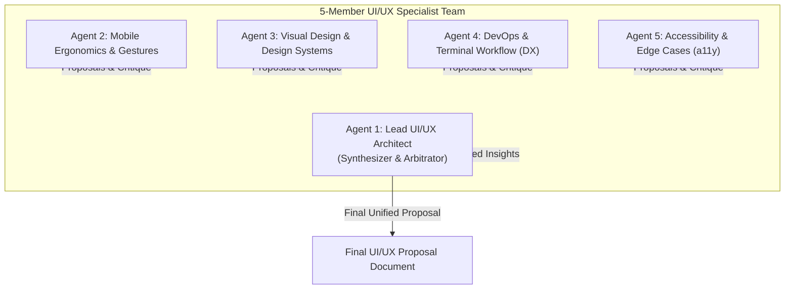

# ShellLite UI/UX Review Team Handover & Blueprint

This document defines the operational setup, team composition, deliberation protocol, and execution instructions for a specialized 5-member UI/UX review team (human designers or autonomous AI agents) tasked with auditing **ShellLite** and delivering a unified, production-ready UI/UX update proposal.

---

## 1. Project Context & Product Philosophy

**ShellLite** is an ultra-fast, minimalist, open-source SSH and terminal client built with Flutter for iOS, Android, macOS, Linux, and Web.

### The "Lite" North Star
Unlike bloated terminal emulators packed with non-essential utilities, ShellLite is strictly guided by the **"Lite" principle**:
- **Distraction-Free Terminal**: The terminal buffer and user input are sacred; UI elements must never intrude on typing or reading.
- **Frictionless Velocity**: 1-tap connections, zero unnecessary confirmation modals, instant inline actions (e.g. inline Ed25519 key generation).
- **Mobile Ergonomics First**: Sysadmins and developers frequently connect to servers from phones with one hand. All primary actions must respect the thumb zone and touch targets.
- **Aesthetic Precision**: Dark, low-eyestrain terminal palettes (Obsidian, Catppuccin Mocha, Dracula, Nord, Tokyo Night, Solarized Dark) with crisp typography and subtle micro-feedback.

### Key Codebase Locations
- [`lib/screens/server_list_screen.dart`](file:///home/aron/projects/ShellLite/lib/screens/server_list_screen.dart): Server inventory, search, live CPU/RAM telemetry chips, terminal settings shortcut, add server FAB.
- [`lib/screens/server_form_screen.dart`](file:///home/aron/projects/ShellLite/lib/screens/server_form_screen.dart): Server configuration, authentication selector (Password vs SSH Key), inline 1-tap key generator, public key copy card, tmux session persistence toggle.
- [`lib/screens/terminal_screen.dart`](file:///home/aron/projects/ShellLite/lib/screens/terminal_screen.dart): Centered title AppBar, compact action buttons (Upload, Paste, Settings, Disconnect), xterm.dart terminal view, native iOS/Android style draggable selection handles with asymmetrical touch bounds, floating copy bar.
- [`lib/widgets/keyboard_accessory_bar.dart`](file:///home/aron/projects/ShellLite/lib/widgets/keyboard_accessory_bar.dart): Virtual accessory row for Esc, Tab, Ctrl, Alt, Arrow keys, and customizable snippets.
- [`lib/widgets/file_upload_modal.dart`](file:///home/aron/projects/ShellLite/lib/widgets/file_upload_modal.dart): SFTP/SCP remote file uploader with pop-scope navigation lock.
- [`lib/widgets/terminal_appearance_modal.dart`](file:///home/aron/projects/ShellLite/lib/widgets/terminal_appearance_modal.dart): Theme selector, font size slider, haptic feedback toggle.
- [`lib/theme/app_theme.dart`](file:///home/aron/projects/ShellLite/lib/theme/app_theme.dart): App color tokens, dark presets, and terminal styling extensions.

---

## 2. Team Composition & Personas

The review team consists of 5 distinct specialists. Each brings a specific lens and set of priorities. Four specialists propose and debate; the **Lead UI/UX Architect** arbitrates, filters against the "Lite" philosophy, and authors the final proposal.



### Agent 1: Lead UI/UX Architect (Lead & Synthesizer)
- **Focus**: Information architecture, end-to-end user journeys, strict alignment with the "Lite" concept, final arbitration.
- **Mindset**: *"If a feature doesn't save the user time or screen space, it doesn't belong in ShellLite."*
- **Responsibilities**:
  - Coordinates review rounds and keeps agents focused on real user value.
  - Vetoes creeping complexity, bloated menus, or unnecessary settings.
  - Synthesizes peer proposals into the final executive proposal document.

### Agent 2: Mobile Ergonomics & Touch Interaction Specialist
- **Focus**: Thumb zone reachability, tap target dimensions (minimum 44×44pt / 48×48dp), gesture physics, virtual keyboard conflict resolution, terminal selection handles.
- **Mindset**: *"A sysadmin troubleshooting a production outage at 2 AM on a moving train needs to tap without misfiring."*
- **Responsibilities**:
  - Audit thumb reachability on [`ServerListScreen`](file:///home/aron/projects/ShellLite/lib/screens/server_list_screen.dart) and [`TerminalScreen`](file:///home/aron/projects/ShellLite/lib/screens/terminal_screen.dart).
  - Inspect accessory bar keyboard interaction and soft keyboard transitions.
  - Review touch handle responsiveness and draggable marker precision.

### Agent 3: Visual Design & Design Systems Specialist
- **Focus**: Color palettes, optical alignment, visual hierarchy, typography scale (monospace vs UI sans), micro-interactions (e.g. "Copied!" feedback), elevation, border radiuses.
- **Mindset**: *"Simplicity is not lack of design; it is the highest form of visual clarity and consistency."*
- **Responsibilities**:
  - Audit consistency across [`AppTheme`](file:///home/aron/projects/ShellLite/lib/theme/app_theme.dart) color tokens, borders, and spacing.
  - Review terminal theme rendering and ensure UI frame matches terminal background harmony.
  - Propose refined micro-animations and status indicators (connected, connecting, error).

### Agent 4: DevOps & Terminal Workflow Specialist (DX)
- **Focus**: Real-world SSH/SysAdmin habits, session persistence (tmux), credential workflows, quick-command bar usability, file transfer friction.
- **Mindset**: *"Every extra tap between launching the app and tailing a remote log is developer friction."*
- **Responsibilities**:
  - Review the server connection lifecycle and server profile creation.
  - Evaluate shortcut accessory keys and custom command snippets.
  - Inspect SCP/SFTP file upload ergonomics and status feedback.

### Agent 5: Accessibility & Edge-Case Specialist (a11y)
- **Focus**: WCAG 2.1 AA contrast compliance, dynamic font scaling, screen reader semantics (`Semantics` / `Tooltip`), network drop indicators, small-screen layouts (e.g. 360px phones), offline states.
- **Mindset**: *"If it breaks on a small screen or with large system fonts enabled, it is not production-ready."*
- **Responsibilities**:
  - Check text contrast across all 6 terminal themes.
  - Test UI resilience under large font sizes (`MediaQuery.textScaler`).
  - Verify accessibility labels, tooltips, and keyboard focus traversals.

---

## 3. Deliberation Protocol & Collaboration Workflow

To ensure high-signal proposals without groupthink, the team operates in **4 sequential rounds**:

### Round 1: Independent Audits & Proposals
Each of the 4 domain specialists (Agents 2–5) performs an isolated review of the app and produces **3 to 5 concrete proposals**.
Each proposal must include:
1. **Screen / Component Target** (e.g., [`TerminalScreen`](file:///home/aron/projects/ShellLite/lib/screens/terminal_screen.dart) AppBar, [`ServerCard`](file:///home/aron/projects/ShellLite/lib/widgets/server_card.dart)).
2. **Current Problem / Friction Point**.
3. **Proposed UI/UX Solution** (with layout sketch or structural description).
4. **User Benefit & "Lite" Rationale**.

### Round 2: Cross-Specialist Critique & Debate (All-to-All)
Every specialist reviews all other specialists' proposals:
- **Ergonomics Agent (2)** checks whether Visual's or DX's suggestions hurt one-handed mobile reachability.
- **Visual Agent (3)** evaluates visual elegance, clutter, and design token consistency of Ergonomics' and DX's ideas.
- **DX Specialist (4)** verifies whether proposals preserve command-line speed or introduce unnecessary friction.
- **a11y Specialist (5)** stress-tests all ideas for contrast, tap target sizing, dynamic text scaling, and edge cases.
- Each specialist submits a short critique (Support, Object with Alternative, or Refine) for each proposal.

### Round 3: Lead UI/UX Architect Evaluation & Prioritization
The Lead Agent (Agent 1) analyzes all proposals and peer critiques, categorizing them into:
- **P0 - Must Have (Immediate Impact)**: High user value, strict adherence to Lite philosophy, strong cross-team consensus.
- **P1 - Should Have (Refined Polish)**: Great ideas requiring minor ergonomic or aesthetic compromises.
- **P2 - Future Exploration**: Good concepts that need more validation or platform testing.
- **Rejected (Anti-Lite / Over-engineered)**: Ideas that add bloat, visual noise, or violate the minimalism principle.

### Round 4: Final Unified UI/UX Proposal Document
The Lead Agent writes the final proposal document, incorporating approved designs, component specs, and actionable Flutter implementation guidance.

---

## 4. Spawning Instructions (Multi-Agent Team Execution)

### Option A: Autonomous Subagent Spawning (Antigravity CLI / IDE)
Run the following instructions to invoke the team in parallel:

```bash
# Recommended command invocation for Antigravity:
/teamwork-preview
```

Or programmatically spawn via the agent framework using the prompts defined below.

#### Lead Agent System Prompt (Agent 1: Lead UI/UX Architect)
```text
You are the Lead UI/UX Architect for ShellLite, an open-source, minimalist Flutter SSH client.
Your mission:
1. Oversee a 5-member UI/UX team reviewing ShellLite.
2. Guard the "Lite" philosophy: absolute minimalism, distraction-free terminal focus, zero clutter, instant mobile connection.
3. Review independent proposals from:
   - Agent 2 (Mobile Ergonomics & Touch Gestures)
   - Agent 3 (Visual Design & Design Systems)
   - Agent 4 (DevOps & Terminal Workflows)
   - Agent 5 (Accessibility & Edge Cases)
4. Moderate cross-critiques between specialists.
5. Author the final comprehensive UI/UX update proposal with prioritized recommendations (P0/P1/P2/Rejected).
```

#### Specialist 2 Prompt (Mobile Ergonomics & Touch Gestures)
```text
You are the Mobile Ergonomics & Touch Interaction Specialist for ShellLite.
Inspect lib/screens/terminal_screen.dart, lib/widgets/keyboard_accessory_bar.dart, lib/widgets/terminal_selection_handle.dart, and lib/screens/server_list_screen.dart.
Focus on:
- One-handed thumb reachability on mobile screens (360px - 430px width).
- Tap targets (minimum 44x44pt).
- Conflict prevention between terminal gesture recognizers and virtual keyboard accessory interactions.
- Highlight handle dragging fluidity.
Provide 3-5 high-impact proposals with clear problem descriptions and ergonomic solutions.
```

#### Specialist 3 Prompt (Visual Design & Design Systems)
```text
You are the Visual Design & Design Systems Specialist for ShellLite.
Inspect lib/theme/app_theme.dart, lib/widgets/server_card.dart, lib/screens/server_form_screen.dart, and lib/widgets/terminal_appearance_modal.dart.
Focus on:
- Visual hierarchy, typography contrast, spacing grid (4px/8px), and component consistency.
- Dark theme aesthetics (Obsidian, Catppuccin Mocha, Dracula, Nord, Tokyo Night, Solarized Dark).
- Micro-interactions (status dots, inline copy animations, selection handles).
- Harmonizing native Flutter widgets with xterm.dart terminal rendering.
Provide 3-5 high-impact proposals with clear visual solutions adhering to the "Lite" aesthetic.
```

#### Specialist 4 Prompt (DevOps & Terminal Workflows)
```text
You are the Developer Experience & Terminal Workflow Specialist for ShellLite.
Inspect lib/screens/terminal_screen.dart, lib/screens/server_form_screen.dart, and lib/widgets/file_upload_modal.dart.
Focus on:
- Real-world SSH workflows: quick connection, reconnecting after network switch, tmux session persistence.
- Key generation and credential storage speed (1-tap inline workflow).
- Virtual keyboard accessory key efficiency (Esc, Tab, Ctrl-C, arrows, custom snippets).
- Remote file transfer ease of use.
Provide 3-5 high-impact proposals that save developers time and remove terminal friction.
```

#### Specialist 5 Prompt (Accessibility & Edge Cases)
```text
You are the Accessibility & Edge-Case Specialist for ShellLite.
Inspect all screens (server_list_screen.dart, server_form_screen.dart, terminal_screen.dart, and modal widgets).
Focus on:
- WCAG 2.1 AA color contrast for UI elements and terminal presets.
- Dynamic font scaling (MediaQuery textScaler) resilience without layout overflows.
- Screen reader semantics, accessible labels, and touch targets.
- Resilient UI behavior during network lag, dropped connections, and narrow screen viewports (320px-360px).
Provide 3-5 high-impact proposals to ensure ShellLite is bulletproof and accessible to everyone.
```

---

## 5. Review Checklist for the Team

When evaluating ShellLite, each specialist must evaluate the following screens and touchpoints:

### Screen 1: Server List Screen (`lib/screens/server_list_screen.dart`)
- [ ] **Empty State**: Is the onboarding clear and welcoming for a first-time user without clutter?
- [ ] **Server Cards**: Are hostnames, ports, and telemetry metrics (CPU/RAM chips) easily scannable?
- [ ] **Card Actions**: Are quick-connect, edit, duplicate, and delete intuitive and hard to mis-tap?
- [ ] **Search / Filter**: Does filtering remain effortless when managing 20+ servers?
- [ ] **Top Bar Actions**: Is the settings icon distinct and appropriately prioritized relative to the Add Server button?

### Screen 2: Server Form Screen (`lib/screens/server_form_screen.dart`)
- [ ] **Form Ergonomics**: Are input fields logically ordered for fast setup?
- [ ] **Auth Mode Toggle**: Is the switch between Password and SSH Key instantaneous and unambiguous?
- [ ] **Inline Key Generator**: Is the 1-tap Ed25519 generation and public key copy card clear and reassuring?
- [ ] **Advanced Settings**: Are the Startup Command and Tmux persistence options accessible without cluttering basic setups?
- [ ] **Validation Feedback**: Are port, host, and key format validation messages non-intrusive yet impossible to miss?

### Screen 3: Terminal Screen & Keyboard Bar (`lib/screens/terminal_screen.dart`)
- [ ] **AppBar Real Estate**: Does the centered server title and compact action cluster (Upload, Paste, Settings, Disconnect) avoid title clipping on 360px screens?
- [ ] **Selection Handles**: Do the left and right markers provide intuitive drag boundaries without covering the selected text?
- [ ] **Floating Copy Bar**: Does the quick copy bar appear predictably without obstructing terminal output?
- [ ] **Virtual Accessory Bar**: Are Esc, Tab, Ctrl, and arrows comfortably reachable above the soft keyboard?
- [ ] **Connection State Indication**: Are "Connecting", "Connected", and "Disconnected" states immediately distinguishable?

### Screen 4: Modals & Sheets
- [ ] **Terminal Settings Modal** (`lib/widgets/terminal_appearance_modal.dart`): Is theme switching and font size adjustment instantaneous with live preview?
- [ ] **File Upload Modal** (`lib/widgets/file_upload_modal.dart`): Is progress feedback clear and is back navigation properly safeguarded?
- [ ] **Accessory Keys Customizer** (`lib/widgets/customize_accessory_keys_modal.dart`): Is reordering and editing custom snippets straightforward?

---

## 6. Structure of the Final Proposal Deliverable

The Lead UI/UX Architect must compile the final output in markdown with the following structure:

1. **Executive Summary**: Overview of audit findings and the team's core UX vision.
2. **Prioritized Action Matrix**:
   | Priority | Feature / Tweak | Impact | Effort | Champion Specialist |
   |---|---|---|---|---|
   | P0 | ... | High | Low | Ergonomics / DX |
3. **Screen-by-Screen Recommended Updates**:
   - For each screen: Current UX pain point, Proposed update, Before/After layout description, and Flutter widget implementation notes.
4. **Design System & Micro-Interactions**:
   - Typography, color updates, touch target standards, and haptic feedback refinements.
5. **Accessibility & Edge-Case Plan**:
   - Contrast improvements, text scaling rules, and reconnection UI state handling.
6. **Next Steps & Implementation Plan**:
   - Suggested development phases and testing validation.
